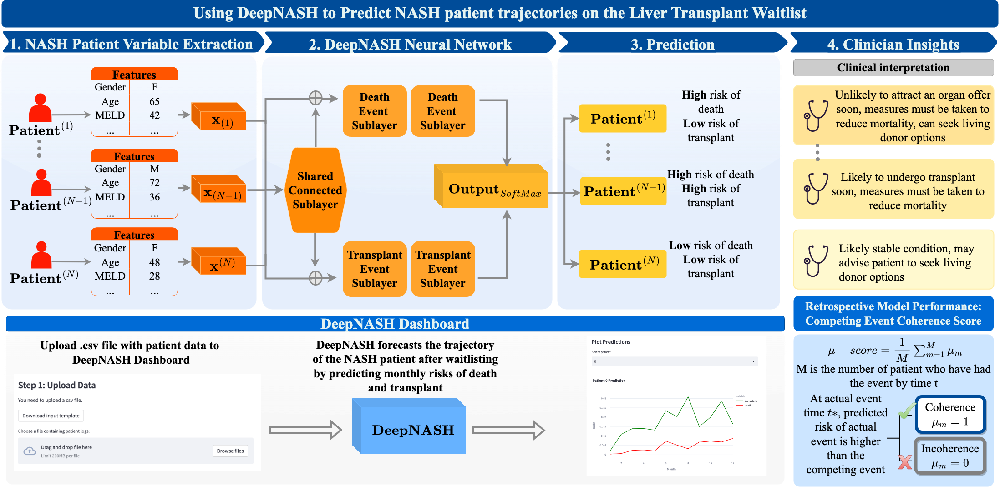

# DeepNASH

A Competing Risk Neural Network Model For Forecasting NASH Patient Trajectories on the Liver Transplant Waitlist


## Model description 
DeepNASH has been trained using SRTR data of NASH patients at the time of listing and the **DeepHIT** model structure to predict the monthly risk of dying on the death and receiving a liver transplant [[1]](#1).

Authors: Gopika Punchhi, Yingji Sun, Sumeet K. Asrani, Sirisha Rambhatla, Mamatha Bhat

* Reference: G. Punchhi, Y. Sun, S. K. Asrani, S. Rambhatla, M. Bhat, "DeepNASH: A Competing Risk Neural Network Model For Forecasting NASH Patient Trajectories on the Liver Transplant Waitlist"


<a id="1">[1]</a> 
C. Lee, W. R. Zame, J. Yoon, M. van der Schaar, "DeepHit: A Deep Learning Approach to Survival Analysis with Competing Risks," AAAI Conference on Artificial Intelligence (AAAI), 2018


## Data requirement for DeepNASH
The processing of the SRTR data (CAND_LIIN dataset) can be done using [data_processing.py](https://github.com/criticalml-uw/DeepNASH/blob/main/model_scripts/data_processing.py) with the re-categeorizaiton of features based on clinical definitions, missing data imputation, and one hot encoding. Sample data post-processing can be viewed here [sample data](https://github.com/criticalml-uw/DeepNASH/blob/main/data/sample_test_data.csv). The template of input features,[data upload template](https://github.com/criticalml-uw/DeepNASH/blob/main/data/data_template.csv), can be viewed and downloaded to be filled and served as input for the model. 

## Using the model 

### Option 1: Streamlit Dashboard 
[](https://deepnash.streamlit.app/)

The model has been implemented in Streamlit with functions of downloading the data template, uploading patient data as *.csv* files, and visualizing the forecasted risk trajectories by DeepNASH. 

### Option 2: Use trained model from scripts
The [trained DeepNASH model](https://github.com/criticalml-uw/DeepNASH/tree/main/model/model) is availble for use with [DeepHit_Prediction.py](https://github.com/criticalml-uw/DeepNASH/blob/main/DeepHit_Prediction.py) and data in the template format.

### For developers
To run the app on your own server, first install the packages with the command

```pip install -r requirements.txt```

Then use the following command to launch the streamlit app on your localhost

```streamlit run DeepHit_Prediction.py```
